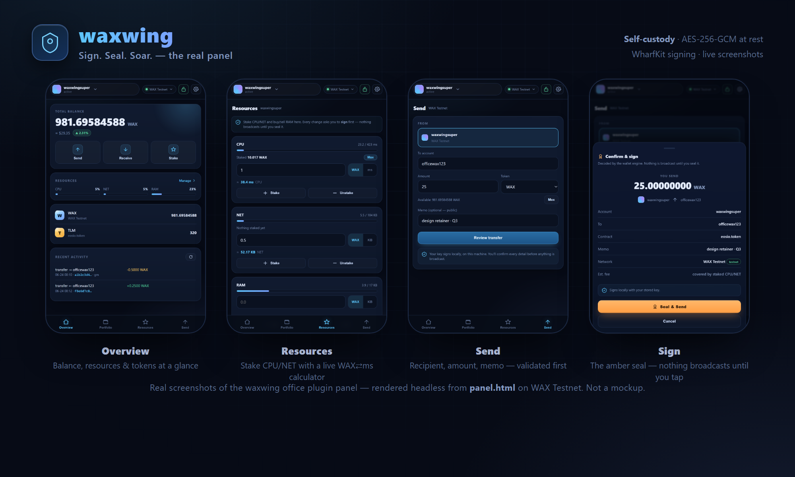

<div align="center">

# 🪙 waxwing

### *Sign. Seal. Soar.*

**A self-custody wallet for Antelope chains (WAX · EOS · Telos · XPR/Proton) — your keys, encrypted, on your machine.**


[](LICENSE)
&nbsp;·&nbsp; Network: **WAX testnet (default)**
&nbsp;·&nbsp; Status: **experimental / testnet-first**

</div>

---

> ## ⚠️ Testnet-first. Experimental. Don't put real money here.
>
> waxwing **defaults to WAX testnet** and is built for learning and development.
> Mainnet networks exist in config (and the panel flags them red), but the crypto
> hardening is **not yet mainnet-grade** — no OS-keystore wrapping, no Argon2id, no
> formal audit. **Do not import a high-value mainnet key.** Use testnet keys you can
> afford to lose. See [Security model](#-security-model) and [`ROADMAP.md`](ROADMAP.md).

---

## What it is

waxwing is a **real self-custody wallet**: it generates and imports keys, stores the
**private keys encrypted at rest**, and **signs + broadcasts real transactions** with a key
it holds locally — no external wallet app, no third-party branding. WAX, EOS, Telos and
XPR/Proton are all [Antelope](https://antelope.io/) chains, so one keystore and one signing
path drive every configured network.

It runs as a [BagIdea Office](https://github.com/bagidea/bagidea-office) plugin — drivable from
the panel **and** from agents over the same `/cmd` endpoint.

**It can:**

- 🔑 Generate a new keypair, or import an existing one (`PVT_K1_…` or legacy WIF `5…`)
- 🔒 Keep private keys **AES-256-GCM encrypted on disk**; decrypt into memory only when unlocked
- ✍️ **Sign + broadcast** real transfers, and create on-chain accounts (`newaccount`)
- 👀 Read balances, account resources (CPU/NET/RAM), and transaction history (Hyperion v2)
- 🌐 Switch between WAX, EOS, Telos and XPR/Proton, testnet and mainnet, from one keystore

## 🔐 Security model

The principle: **no server holds your key — it's self-custody, encrypted, and local-only.**

| Property | How |
|---|---|
| **Encrypted at rest** | Private keys are encrypted with **AES-256-GCM**. The encryption key is derived from your password via **scrypt** (`N=2¹⁷`, built-in, no native deps). |
| **On disk** | The keystore (`data/keystore.json`) holds **only** ciphertext + KDF params + the *public* key. **No plaintext private key ever touches disk.** |
| **In memory only** | A plaintext key exists **only in RAM** while the wallet is unlocked — fed straight into the local signer, never logged, never sent over the network. |
| **Auto-lock** | Unlocked keys are wiped on `lock` **and automatically after 10 minutes** of being unlocked. |
| **Tamper-evident** | A wrong password (or any tampering with the ciphertext) fails the GCM auth tag and is rejected — never silently decrypted to garbage. |
| **Loopback only** | All key operations run server-side over `127.0.0.1`; passwords never leave the loopback interface. |

> Argon2id would be the ideal KDF but needs a native build on Windows; **scrypt `N=2¹⁷`** is the
> sanctioned dependency-free fallback (see [`MEMO-wallet-risk-clearance.md`](MEMO-wallet-risk-clearance.md)).
> Mainnet-grade hardening (OS keystore, Argon2id, IPC/CSP hardening, supply-chain pinning) is
> tracked in [`ROADMAP.md`](ROADMAP.md) and **not yet done** — hence testnet-first.

## 🌐 Supported chains

Config-driven via the `CHAINS` map in `index.js`. All eight chain ids are verified live.

| id | network | core token | kind |
|---|---|---|---|
| `wax-testnet` **(default)** | WAX Testnet | WAX (8 dp) | testnet |
| `wax-mainnet` | WAX Mainnet | WAX (8 dp) | ⚠️ mainnet |
| `eos-testnet` | EOS Jungle4 | EOS (4 dp) | testnet |
| `eos-mainnet` | EOS Mainnet | EOS (4 dp) | ⚠️ mainnet |
| `telos-testnet` | Telos Testnet | TLOS (4 dp) | testnet |
| `telos-mainnet` | Telos Mainnet | TLOS (4 dp) | ⚠️ mainnet |
| `xpr-testnet` | XPR Network Testnet | XPR (4 dp) | testnet |
| `xpr-mainnet` | XPR Network (Proton) | XPR (4 dp) | ⚠️ mainnet |

Switch the persisted default with `setnetwork`, or override a single read with
`{"network":"eos-mainnet"}` in the command args.

## 📦 Install (as an Office plugin)

waxwing is an office plugin — it loads inside [BagIdea Office](https://github.com/bagidea/bagidea-office):

1. **From source / your fork:** **🧩 Plugins → paste the GitHub URL.** The office clones the
   repo into `plugins/wax-wallet/` (the plugin `id` is `wax-wallet`) and loads it.
2. **Install dependencies** — waxwing signs offline via WharfKit, so it needs its npm deps:
   ```bash
   cd plugins/wax-wallet && npm install
   ```
3. **Reload** without restarting the app:
   ```bash
   curl -s -X POST http://127.0.0.1:8787/plugins/reload -H "x-bagidea-ui: 1"
   ```
4. Open the panel, or drive it from an agent:
   ```bash
   curl -s -X POST http://127.0.0.1:8787/plugin/wax-wallet/cmd \
     -H "content-type: application/json" -d '{"cmd":"status"}'
   ```

### Quick start (testnet)

```bash
# 1. get a funded testnet account (returns a keypair + funds it with ~500 test WAX)
curl "https://faucet.waxsweden.org/create_account?myacct123456"
curl "https://faucet.waxsweden.org/get_token?myacct123456"

# 2. import its active key (stored encrypted under your password)
curl -s -X POST :8787/plugin/wax-wallet/cmd \
  -d '{"cmd":"import","args":{"password":"pw","privkey":"PVT_K1_…","account":"myacct123456"}}'

# 3. unlock, then sign + broadcast a real testnet transfer
curl -s -X POST :8787/plugin/wax-wallet/cmd -d '{"cmd":"unlock","args":{"password":"pw"}}'
curl -s -X POST :8787/plugin/wax-wallet/cmd \
  -d '{"cmd":"send","args":{"from":"myacct123456","to":"eosio","quantity":"1.0 WAX","memo":"hi"}}'
```

Full command list: run `{"cmd":"status"}`, or see [`plugin.json`](plugin.json).

## 📸 Screenshots

Real screenshots of the actual panel (`panel.html`, rendered headless — not a mockup):
**Overview** (balance, resources & tokens) · **Resources** — stake CPU/NET with a live **WAX⇄ms** calculator · **Send** · and the amber **Sign** seal (nothing broadcasts until you tap).



<!-- Captures are rendered from the live panel.html. Add a recorded GIF of a live testnet send here as the UI evolves. -->

## 🛠 Stack

- [`@wharfkit/antelope`](https://wharfkit.com/) — key generation / import / crypto primitives
- [`@wharfkit/session`](https://wharfkit.com/) + `@wharfkit/wallet-plugin-privatekey` — offline signing + broadcast
- Node built-in `crypto` — scrypt + AES-256-GCM keystore ([`keystore.js`](keystore.js))

`index.js` is CommonJS (the office loader `require()`s it); the ESM WharfKit deps load via
dynamic `import()`. `npm install` is required (no build step otherwise).

## 🗺 Roadmap & limitations

See [`ROADMAP.md`](ROADMAP.md). In short, **not yet done**: mainnet-grade hardening, multi-sig,
permission-management UI, RPC failover, and a richer token-transfer UI. Mainnet networks are
reachable but **not hardened for real funds**.

## 🤝 Contributing

PRs welcome — see [`CONTRIBUTING.md`](CONTRIBUTING.md). The hard rule: never weaken the
key-handling guarantees (no plaintext at rest, no key over the wire, no server-side key custody).

## 🏷 Brand

The name/logo are waxwing's own (not affiliated with any third-party wallet). The single source
of truth is the `BRAND` const in `index.js` (the panel fetches `/plugin/wax-wallet/brand`);
`plugin.json.name` mirrors it. Full kit in [`brand/BRAND.md`](brand/BRAND.md).

## 📄 License

[MIT](LICENSE) © 2026 BagIdea. WharfKit is © Greymass (BSD-3), used as a dependency.
